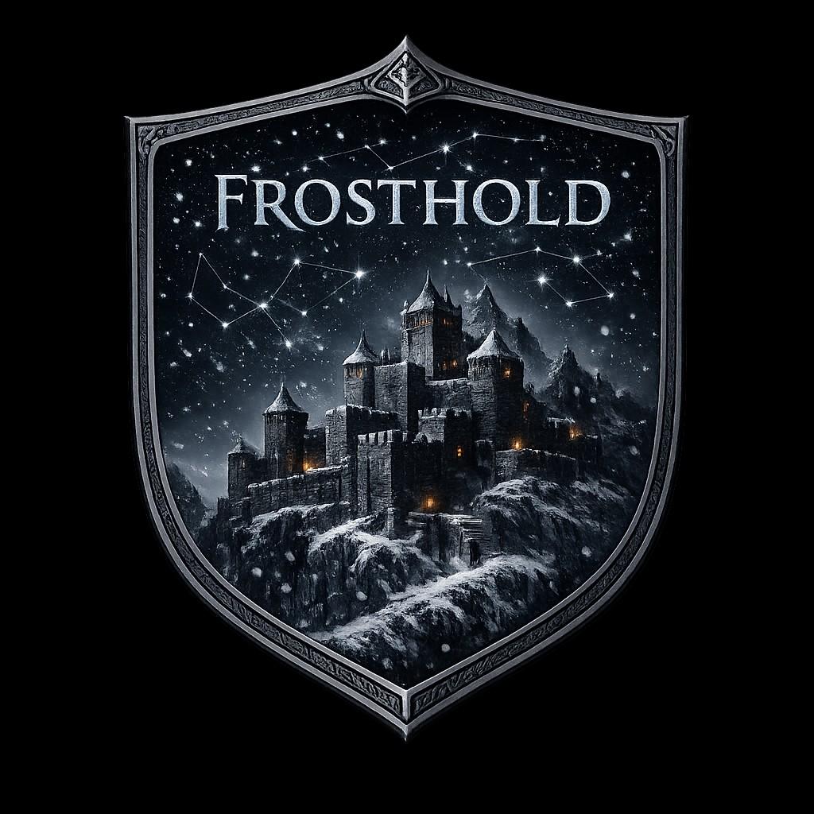

  

<h1 align="center">FrostholdRP Launcher</h1>

  <em>Erkunde Himmelsrand. Gemeinsam.</em>

  

---

## Was ist FrostholdRP?

**FrostholdRP** ist eine deutschsprachige Rollenspiel-Community in **The Elder Scrolls V: Skyrim Special Edition** — nur eben **nicht allein**. Statt sich durch Himmelsrand zu einzelspielern, läufst du denselben Drachen wie deine Freunde entgegen, handelst mit Fremden am Stadttor von Weißlauf und erlebst deine eigene Geschichte in einer Welt, die gerade weiterlebt, während du offline bist.

Kein Fraktionskrieg um Punkte, keine PvP-Arena als Hauptgericht — **immersives Rollenspiel** steht im Mittelpunkt. Handwerk, Zünfte, Intrigen zwischen den Großen Häusern, Nachtlager an Feuerstellen, an denen ihr euch die Geschichten wirklich erzählt.

---

> ## ⚠️ Alpha-Stadium — bitte zuerst lesen
>
> **FrostholdRP steckt aktuell in einer sehr frühen Alpha.** Es gibt **noch keine Spielinhalte** im klassischen Sinne: keine Quests, keine NPCs mit Leben, keine funktionierenden Gilden, kein ausbalanciertes Wirtschaftssystem. Wer sich einloggt, landet in einer **im Kern leeren Welt** — Himmelsrand steht da, aber es wartet niemand auf dich.
>
> **Was du erwarten darfst:** Grundgerüst, Charaktererstellung, dich mit Freunden sehen und bewegen, erste Feature-Tests.
>
> **Was du nicht erwarten darfst:** stabile Sessions, fertiges Gameplay, Bugfreiheit, persistente Welt. Saves können zurückgesetzt, Mechaniken umgebaut und Server ohne Vorwarnung neu gestartet werden.
>
> Das Projekt wird **stetig und aktiv weiterentwickelt** — wer jetzt einsteigt, schaut eher beim Bauen zu, als dass er fertiges Spiel konsumiert. Wenn du trotzdem Lust hast, einen Blick zu riskieren und Feedback beizusteuern: herzlich willkommen. Wenn du auf "Server betreten und direkt Rollenspiel" hoffst, komm in ein paar Monaten wieder.

---

## Was macht dieser Launcher?

Der **FrostholdRP Launcher** ist dein Eintrittspunkt. Er nimmt dir das ganze technische Drumherum ab, damit du direkt ins Spiel kommst:

- **Ein-Klick-Installation** aller nötigen Komponenten für den Multiplayer-Modus
- **Automatische Updates** des Clients — Balance-Änderungen und neue Features bekommst du ohne Handarbeit
- **Integritäts-Checks** vor jedem Start, damit korrupte Dateien nicht zur Session-Killer werden
- **Saubere Deinstallation** — wenn du pausieren willst, bleibt dein Singleplayer-Skyrim unberührt
- **Schlankes UI** im Skyrim-Stil, mit Statusanzeige, News und Discord-Anbindung

Der Launcher ist eine Electron-App für **Windows (x64)**, NSIS-Installer oder Portable-Variante — wie du willst.

## So kommst du rein

1. **Skyrim Special Edition** via Steam besitzen und einmal gestartet haben  
2. Den [aktuellen Installer](https://github.com/Eisteesuchti/Frosthold-Launcher/releases/latest) herunterladen und ausführen  
3. **„Aktualisieren"** → **„Spielen"** — fertig.

Alles Weitere — Client-Dateien, SKSE, Konfiguration — erledigt der Launcher im Hintergrund.

## Mitmachen

Schau auf unserem Discord vorbei, wenn du Lust auf konsequentes Rollenspiel in einer lebendigen Community hast.  
*(Einladungslink kommt bald — aktuell sind wir in geschlossener Beta.)*

## Lizenz & Credits

Das Skyrim-Multiplayer-Fundament basiert auf dem Open-Source-Projekt **[SkyMP](https://github.com/skyrim-multiplayer/skymp)**. Dieser Launcher ist eine unabhängige, nicht-kommerzielle Distribution.

**The Elder Scrolls V: Skyrim** ist ein eingetragenes Markenzeichen von Bethesda Softworks LLC. FrostholdRP steht in keiner Verbindung zu Bethesda Softworks, ZeniMax Media oder deren Tochterunternehmen.
